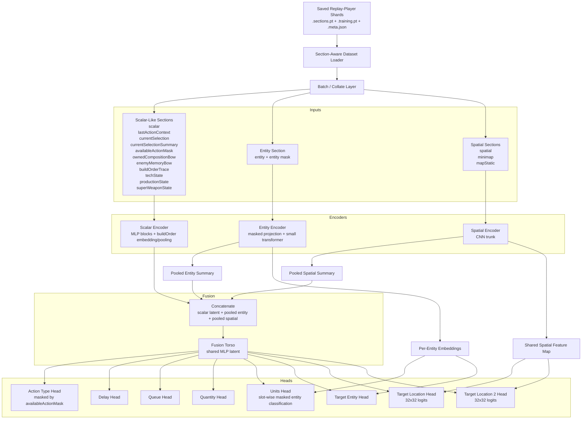

# RA2 SL Model Structure Graph

This graph describes the recommended V1 supervised-learning model for RA2 on top of the current `chronodivide-bot-sl` tensor pipeline.

## High-Level Graph



## Training Graph

```mermaid
flowchart TD
    A[Model Outputs]
    B[Derived Targets From .training.pt]
    C[Loss Masks From .training.pt]

    A --> D[actionType logits]
    A --> E[delay logits]
    A --> F[queue logits]
    A --> G[units logits]
    A --> H[targetEntity logits]
    A --> I[targetLocation logits]
    A --> J[targetLocation2 logits]
    A --> K[quantity prediction]

    B --> D1[actionTypeOneHot]
    B --> E1[delayOneHot]
    B --> F1[queueOneHot]
    B --> G1[unitsOneHot]
    B --> H1[targetEntityOneHot]
    B --> I1[targetLocationOneHot]
    B --> J1[targetLocation2OneHot]
    B --> K1[quantityValue]

    C --> D2[actionTypeLossMask]
    C --> E2[delayLossMask]
    C --> F2[queueLossMask]
    C --> G2[unitsLossMask]
    C --> H2[targetEntityLossMask]
    C --> I2[targetLocationLossMask]
    C --> J2[targetLocation2LossMask]
    C --> K2[quantityLossMask]

    D --> L1[Masked CE]
    D1 --> L1
    D2 --> L1

    E --> L2[Masked CE]
    E1 --> L2
    E2 --> L2

    F --> L3[Masked CE]
    F1 --> L3
    F2 --> L3

    G --> L4[Masked CE]
    G1 --> L4
    G2 --> L4

    H --> L5[Masked CE]
    H1 --> L5
    H2 --> L5

    I --> L6[Masked CE]
    I1 --> L6
    I2 --> L6

    J --> L7[Masked CE]
    J1 --> L7
    J2 --> L7

    K --> L8[Masked Quantity Loss]
    K1 --> L8
    K2 --> L8

    L1 --> Z[Total SL Loss]
    L2 --> Z
    L3 --> Z
    L4 --> Z
    L5 --> Z
    L6 --> Z
    L7 --> Z
    L8 --> Z
```



## Compact ASCII View

```text
saved shards
  -> dataset loader
  -> collate
  -> {
       scalar-like sections -> scalar encoder
       entity section       -> entity encoder -> pooled summary + per-entity embeddings
       spatial sections     -> spatial encoder -> pooled summary + spatial map
     }
  -> fusion torso
  -> heads {
       action_type
       delay
       queue
       units
       target_entity
       target_location
       target_location_2
       quantity
     }
  -> masked SL losses
```

## V1 Notes

- V1 is intentionally non-recurrent.
- V1 `units` prediction is slot-wise masked classification, not AlphaStar-style autoregressive EOF decoding yet.
- `availableActionMask` is used as an input feature and should also be usable as an action-type logit mask.
- `entity` and `spatial` branches should stay shared across multiple heads.
